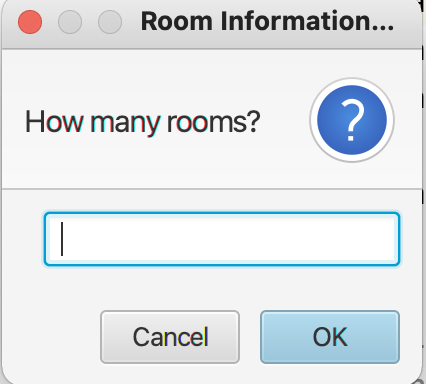
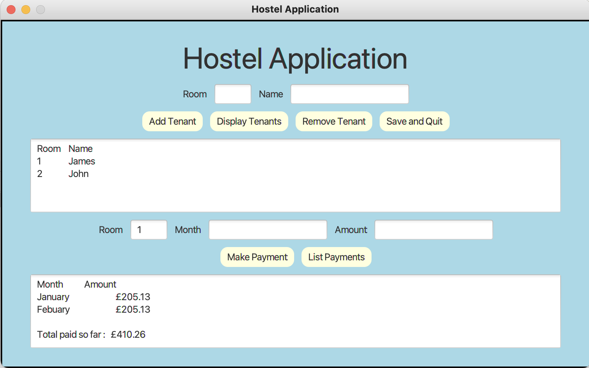
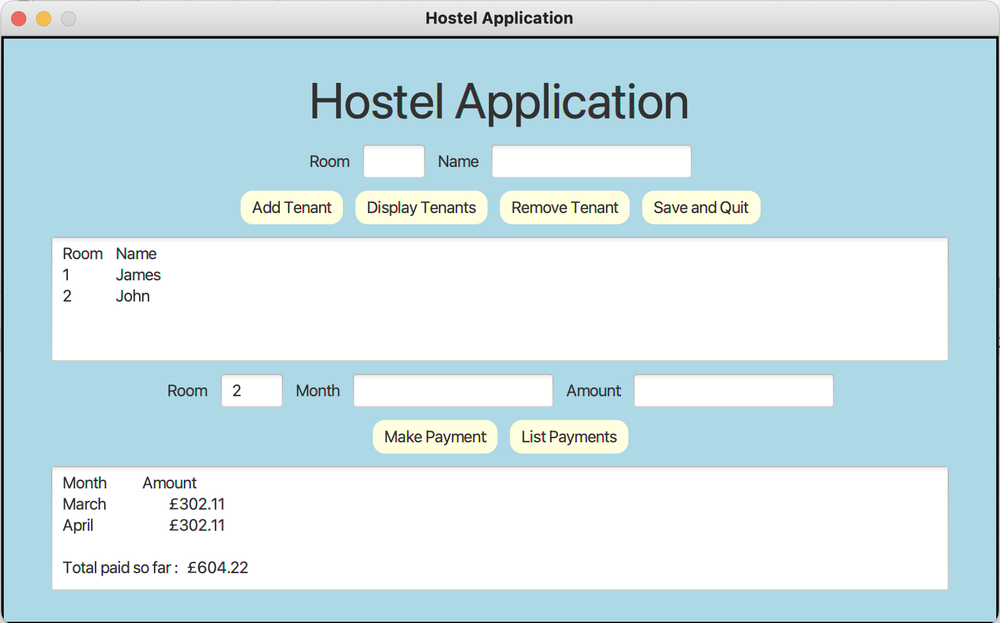

# Student Hostel Management Application

## The Requirements Specification:

* A local university requires a program to manage one of its student hostels, which
contains a number of rooms, each of which can be occupied by a single tenant who
pays rent on a monthly basis. 

* The program must keep a list of tenants and their monthly payments. The information 
held for each tenant will consist of a name, a room number and a list of all the payments 
a tenant has made (month and amount) for one year. 

* The program must allow the user to add and delete tenants, to display
a list of all tenants, to record a payment for a particular tenant, and to display the
payment history of a tenant.

## Installing:

1. Clone the repo

```
https://github.com/AAdewunmi/HotelManagementApp_Project.git
```

2. Open Project Folder


3. Explore

Enjoy :)

## App UI:

1. Select number of students:



2. Student 1 payment details:



3. Student 2 payment details:




```
Reproduced from "Java in Two Semesters: Featuring JavaFX. Springer" 

(Case Study - Part 1 / Case Study - Part 2).

Charatan, Q., & Kans, A. (2019). Java in Two Semesters: Featuring JavaFX. Springer.
```
